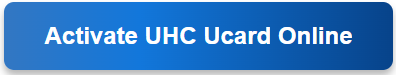

========================
Activate UHC Ucard Online
========================

Activate Your UHC Ucard Online at Activate.UHC.com
=================================================

|

|

**UnitedHealthcare (UHC)** provides the UCard, which serves as a member ID, OTC benefits card, and more. Before using it, you must activate your UCard online at **Activate.UHC.com**. This guide will help you complete the activation process quickly and securely.

Steps to Activate Your UHC UCard Online
======================================

1. Open your web browser and go to **Activate.UHC.com**.
2. Provide your UHC Member ID (found on your UCard).
3. Enter your date of birth and ZIP code for verification.
4. If you don’t have a myUHC account, you may need to create one.
5. Choose a username and password, and set up security questions.
6. UHC may send a verification email or text. Follow the instructions to confirm your identity.
7. Once verified, your UCard will be activated.
8. You can now use your UCard for healthcare services, pharmacy benefits, and Over-the-Counter (OTC) purchases.

Benefits of Activating Your UHC UCard
=====================================

✔️ Easy Access to Healthcare Services
✔️ Use for Over-the-Counter (OTC) Purchases
✔️ Pay for Eligible Medical Expenses
✔️ View Digital ID Cards on MyUHC.com
✔️ Track Medical Claims & Coverage Details

Troubleshooting UCard Activation Issues
=======================================

* Double-check your member ID, date of birth, and ZIP code for accuracy.
* Try using a different web browser or clearing your cache if the page isn’t loading.
* If you face issues, contact UHC Customer Support at -> Click here.

Conclusion
==========

**Activating your UHC UCard online** is simple and ensures seamless access to your health benefits. Follow the steps above to complete your activation and start using your **UCard** today!
